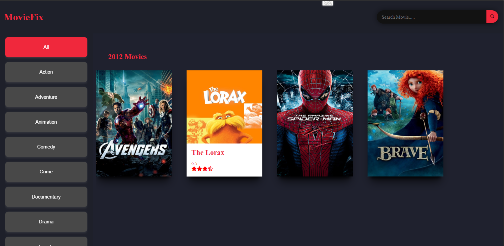

#  Movie List app

Your users should be able to:

- View the optimal layout for each page depending on their device's screen size.
- Provided a filter UI that allows users to filter movies by genre.
- Displayed a list of movies sorted in descending order of popularity.
- Show the movie title, image, genre, cast, director, and a short description related
 to the movie in each information card.
- Implement smooth scrolling behavior to load more movies as the user scrolls in
 any direction i.e load movies of previous year when user scrolls up and load
 movies of next year when user scrolls down until the current year.
- Implemented a search bar which searches for the movie based on the search string
 and displays an infinite loading list of movies which matches the search.

### `npm start`

Runs the app in the development mode.\
Open [http://localhost:3000](http://localhost:3000) to view it in your browser.

The page will reload when you make changes.\
You may also see any lint errors in the console.

### `npm run build`

Builds the app for production to the `build` folder.\
It correctly bundles React in production mode and optimizes the build for the best performance.

The build is minified and the filenames include the hashes.\
Your app is ready to be deployed!

### Built with

- HTML
- CSS
- React
- Animation

### Links
- Solution URL: [movie_List_app](https://github.com/sukanyagurav/IP-address-tracker)
- Live Site URL: [Movie_List_App](https://iptrakcer.netlify.app/)
